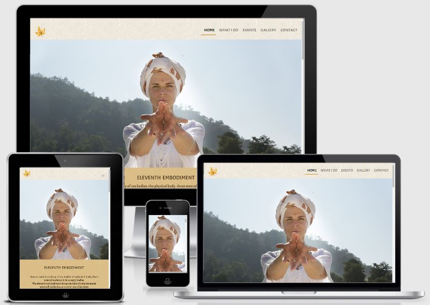
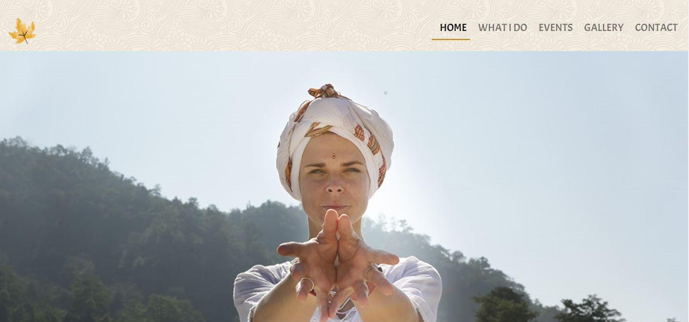
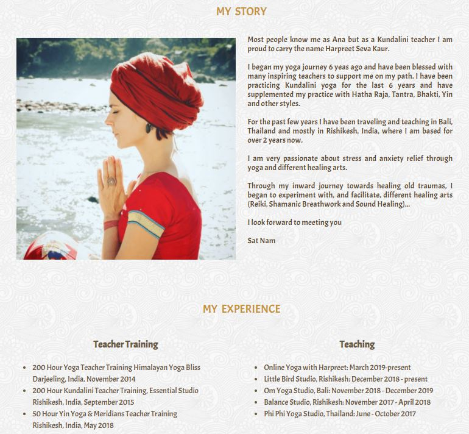
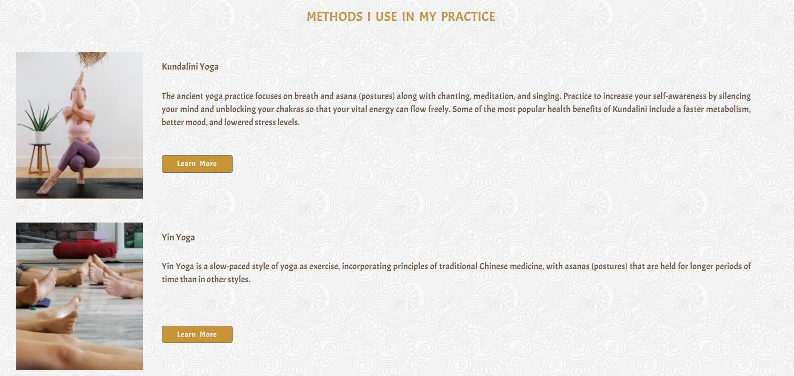
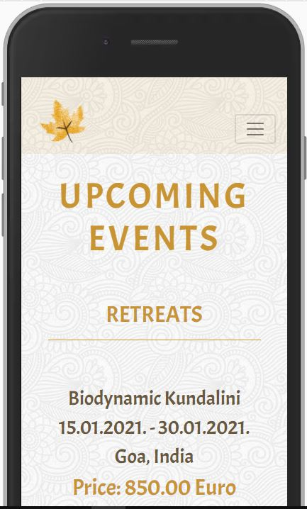
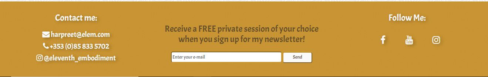
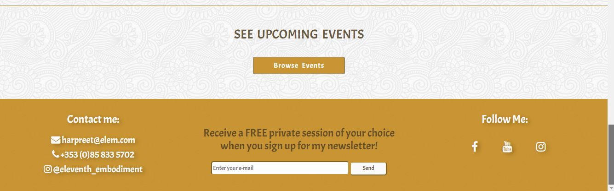
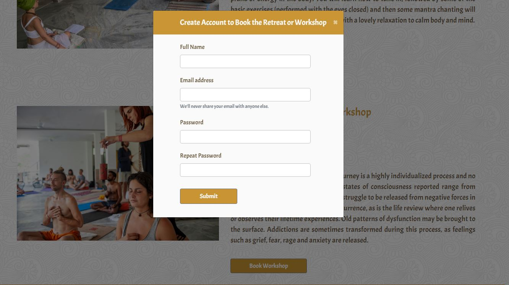
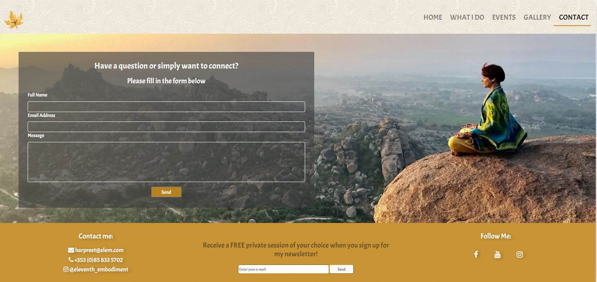

# Eleventh Embodiment

The live project can be found here [Eleventh Embodiment](https://tanya-go.github.io/eleventh-embodiment/)

## Contents:

* [Description](#description)
* [UX](#ux)
* [Strategy](#strategy)
* [Scope](#scope)
* [Structure](#structure)
* [Skeleton](#skeleton)
* [Surface](#surface)
* [Technologies Used](#technologies-used)
* [Testing](#testing)
* [Deployment](#deployment)
* [Credits](#credits)
* [Acknowledgements](#acknowledgements)

# Description

The main purpose of this project was to build a website for my First Milestone Project as a part of the Full Stack Web Developer Diploma course, using knowledge of HTML and CSS only.
I have decided to build a website for a friend of mine who is a yoga teacher and an alternative healer. Idea was to create a place where people can learn about different types of yoga and 
different healing techniques that she provides, and to be able to book yoga or healing sessions, workshops and/or retreats.
Website owner's goal is to attract more visitors to the website wich will result in a bigger community, larger following on social media, and ultimately more people booking her classes, healing sessions and/or retreats.  

# UX

## Strategy
The website should be easy to navigate and should encourage the user to explore all the pages to learn all about the site owner's skills and experience. 
The site should be simple but elegant and bright, which will be accomplished with using white, gold and warm brown colours.

### User Stories

#### First time user
  As a first time user,
* I want to be able to  navigate through the site easily to find information and services available
* I want to learn more about the site owner and their skills and offering
* I want to be able to see the website clearly on my mobile device
* I want to find ways to follow the owner on different social media platforms

#### Returning User
  As a returning user,
* I want to check if there are any new classes and/or retreats 
* I want to book online classes, workshops and/or retreats 
* I want to contact the owner to find out more information about their services

#### Frequent User
  As a Frequent user,
* I want to see if there are any new upcoming events
* I want to sign up to the newsletter to get the latest news and offers/discounts
---

## Scope 

### Features
- On the "Home" page under "Methods I use in my practice" there is a "Learn More" button that leads to a "What I Do" page where all methods 
   are explained in detail.
- User can click a button on the "Home" page and browse upcoming events - the "Browse Events" button leads to a separate "Events" page where all upcoming events are listed
- User can book a class on "What I do" page - the "Book Class" button opens a modal where user can open an account and book a class. Idea was to have the user open the account first and then book a class so they can become a member. This will make it easier for them to book next time, 
   plus the owner will collect their email for future marketing campaigns
- Option to sign up to the newsletter is in the footer across all pages, offering a free session to attract more subscribers
- Option to contact the site owner through the form located on the "Contact" page or links in the footer
- "What I Do" page has an "Ask for Advice" button where user can contact the site owner and ask for advice regarding their services
- There is a video on "Events" page that shows one of the previous retreats, the user needs to click the video to play, it is not set to autoplay

 
### Features Left to Implement
- We will eventually add more pages when the owner will have enough content 
- Currently, the contact forms do not send any information so site owner is not collecting any information about users 
- Plan is to implement a payment system where a user can pay for a class, workshop or a retreat through the website

## Structure

- Each page will contain the navigation bar at the top of the page so that the user can easily navigate the site and
know which site they are on at all times.\
    The purpose is to fulfil the user story - I want to be able to  navigate through the site easily to find information and services available
- Home page will contain information about the owner and their experience in the industry\
   The purpose is to fulfil the user story - I want to learn more about the site owner and their skills.
- At the bottom of the home page user will have the option to view the upcoming events.\
    The purpose is to fulfil the user story - I want to check if there are any new classes and/or retreats
- Footer will remain the same across all pages and will contain contact information as well as social media links so user can easily contact or connect with the site owner.\
    The purpose is to fulfil the user stories:\
    I want to find ways to follow the owner on social media platforms and \
    I want to contact the owner to find out more information about their services
- "What I do" page will contain details about each of the yoga styles and healing techniques site owner is providing and teaching. 
   The purpose is to fulfil the user story - I want to learn more about the site owner and their skills.
- Site will be made responsive using Bootstrap grid and media queries to fulfil the user story\
    I want to be able to see this website clearly on my mobile device

## Skeleton

### Wireframes 

[Home Page](https://github.com/TanYa-Go/eleventh-embodiment/tree/master/assets/wireframes)\
[About Page](https://github.com/TanYa-Go/eleventh-embodiment/blob/master/assets/wireframes/about.pdf)\
[Gallery Page](https://github.com/TanYa-Go/eleventh-embodiment/blob/master/assets/wireframes/gallery.pdf)\
[Events Page](https://github.com/TanYa-Go/eleventh-embodiment/blob/master/assets/wireframes/events.pdf)\
[Contact Page](https://github.com/TanYa-Go/eleventh-embodiment/blob/master/assets/wireframes/contact.pdf)

### Differences from the original design
Originally the idea was to have a "Home" page for general information about the page and clarification on the website name. "About" page would have information about the owner and their pictures. 
Then we would have separate pages for "Yoga" and "Healing". And also separate pages for "Retreats". 
After testing some options and considering user stories, I realized that the purpose of the website was not clear, and also the site owner did not have enough content
for all those pages yet, so we decided to change it. 
In the final design, some parts of the old "About" page are moved to the "Home" page and "About" page became "What I Do" page. It makes it clearer for the user and also makes more sense to include more "CTA" -s 
which the owner wanted to display wherever possible.
Initial wireframes were not changed so I can showcase the original idea which ultimately led to the current design and layout. 

## Surface

### Design 

 #### Typogroaphy 
 Google font Acme was used throughout the website, with the fallback font of sans serif in case the original one doesn't display.

#### Colors
  An off white shade #fafafa was used for the text to contrast the gold #c4881be3 backgrounds.\
  The same gold color was used for borders and titles and quotes.\
  For the text, the greyish/brown hsla(38, 38%, 25%, 0.89) color was used for easier reading.\
  There was a need to use text-shadow rgba(0, 0, 0, 0.3) on some titles and on the qoute, for easier reading of gold or white letters.

## Technologies Used

1. [HTML](https://en.wikipedia.org/wiki/HTML#:~:text=Hypertext%20Markup%20Language%20(HTML)%20is,scripting%20languages%20such%20as%20JavaScript.)

1. [CSS](https://en.wikipedia.org/wiki/CSS)

1. [Bootstrap 4.4.1:](https://getbootstrap.com/docs/4.4/getting-started/introduction/)
    - Bootstrap was used to assist with the responsiveness and styling of the website.
1. [Google Fonts:](https://fonts.google.com/)
    - Google fonts were used to import the 'Acme' font into the style.css file which is used on all pages throughout the project.
1. [Font Awesome:](https://fontawesome.com/)
    - Font Awesome was used to add icons.
1. [jQuery:](https://jquery.com/)
    - jQuery came with Bootstrap to make the navbar responsive.
1. [Gitpod](https://www.gitpod.io/)
   - Gitpod was used to create the code for the project.
1. [Git](https://git-scm.com/)
    - Git was used for version control by utilizing the Gitpod terminal to commit to Git and Push to GitHub.
1. [GitHub:](https://github.com/)
    - GitHub is used to store the project's code after being pushed from Git.
1. [Balsamiq:](https://balsamiq.com/)
    - Balsamiq was used to create the wireframes during the design process.
1. [TinyPNG](https://tinypng.com/)
    - TinyPNG was used to reduce the overall total image size
1. [Chrome Developer Tools](https://developers.google.com/web/tools/chrome-devtools)
 - Used during the process of creating the website to help with design and debugging some issues

## Bugs found while creating the website
- Font Awesome icons were not showing in the footer of the "Home" page while they were showing on other pages. I then realized I had different font awesome version in the
 index.html and after I replaced it, it was working
- Navbar collapsed menu button was not showing but it was there and working when clicked. With help of my mentor, we found the solution - adding the class "navbar-light" in the HTML solved the problem

# Testing

## Testing was completed in the following stages: 
1. Test all code is working and passes through the validators without errors
2. Test website responsiveness across various browsers and various devices to confirm that the website is fully responsive
3. Test that all features work as intended by testing user stories
 

### 1. Code validators

[HTML validator](https://validator.w3.org/) returned the following errors:

1. "The document is not mappable to XML 1.0 due to two consecutive hyphens in a comment"\
    The solution was found on [Experts Exchange](https://www.experts-exchange.com/questions/28661509/The-document-is-not-mappable-to-XML-1-0-due-to-two-consecutive-hyphens-in-a-comment.html)
 
2. "Section lacks heading. Consider using h2-h6 elements to add identifying headings to all sections"\
    The solution was found on [Stackoverflow](https://stackoverflow.com/questions/24155024/w3c-html-validation-error-section-lacks-heading-consider-using-h2-h6-elements)

3. "The aria-labelledby attribute must point to an element in the same document"\
 The solution was found on [Stackoverflow](https://stackoverflow.com/questions/39831658/how-to-fix-the-aria-labelledby-attribute-must-point-to-an-element-in-the-same-d)

[CSS Validator](https://jigsaw.w3.org/css-validator/)

Returned no errors 

### 2. Responsiveness

1. Initial tests were done using Chrome Dev Tools to make sure the website was responding properly on all screen sizes from 320px upwards
2. Then an app called [Responsively](https://responsively.app/) was used to test multiple screen sizes in one place
   
   Screen sizes tested:
    - iPhone X          
    - Pixel 2            
    - iPad              
    - Generic Laptop     
    - Moto G4           
    - Surface Duo         

3. Then I tested the following actual devices:
   - iPhone 7  
   - iPhone 11    
   - Xiaomi Pocophone F1
   - Huawei P10         
   - A1 Alpha 20+       
   - iPad
   - Lenovo Laptop G780

  Testing was done by checking the website on each device in portrait and lanscape mode, apart from the Laptop, which was cheked only in landscape mode. Making sure that each page renders correctly
 
4. The following Browsers were tested:
   - Google Chrome
   - Microsoft Edge
   - Mozilla
   - Safari
   - Opera

   Testing was done in the following manner - I opened the website url in each browser and then right clicked to open the inspector to be able to resize down 
   to the 320px, to make sure that all pages are responsive in all screen sizes.

### 3. User Stories

1. I want to be able to  navigate through the site easily to find information and services available

   Upon entering the website the user can see the navigation bar with different pages, which makes it easy to navigate the website.\
   Each menu item, when clicked, redirects to a coresponding page.\
   Logo, when clicked, leads to the "Home" page regardless of the page user is on.\
   There is a line under navbar menu item, to show the user what page they are  currently on.

   

2. I want to learn more about the site owner and their skills and offering

   When user gets to the "Home" page they can immediately see site owners story, their skills and experience.\
   Under that section, they can see the section with the methods the site owner uses in her practice and they can click a button to learn more.\
   "Learn More" button, when clicked, leads to the "What I Do" page where the user can find our more information about each of the methods site owner uses.
 
 

3. I want to be able to see the website clearly on my mobile device

   Extensive testing was done, as described in the device testing above, to make sure that the page renders well on all screen sizes but with mobile first approach in mind.
   
   

4. I want to find ways to follow the owner on different social media platforms
  
   User can find the owners social media in the footer on all the pages. Icons, when clicked, open in a new window and currently they show the "Home" page of the respective social media.\
   In future this icons will lead to the site owners actual social media accounts.
  
   

5. I want to check if there are any new classes and/or retreats

   From the "Home" page the user can navigate to the "Events" page where all the upcoming events - retreats, workshops and classes are listed.\
   User can also click the "Browse Events" button on the "Home" page which will lead them to the "Events" page.

   

6. I want to book online classes, workshops and/or retreats

   To book an event,  user can click a "Book Workshop" or "Book Retreat" button on the "Events" page which will then open a modal where user can create their account and proceed to book desired event.
   
   

7. I want to contact the owner to find out more information about their services

   User has few options to contact the site owner:
    -  By clicking on the email address in the footer, on all pages. When clicked, the user is redirected to the "Contact" page where they can fill out the form to conact the site owner
    -  Also there is a contact number diplayed in the footer across all the pages
    -  User can also contact the site owner via their instagram, by clicking on their instagram handle in the footer. Currently, if clicked, user is redirected to Instagram's "Home" page

    

8.  I want to see if there are any new upcoming events 

    User can find upcoming events by clicking on the "Events" menu tab on the "Home" page and also by clicking the "Browse Events" button on the bottom of the "Home" page, 
    which will also lead them to the "Events" page

9. I want to sign up to the newsletter to get the latest news and offers/discounts

   To sign up to the newsletter, the user can type their email address in the input field in the footer. It is available on all the pages.

  

### Conclusion

- Each navbar menu item is clickable from each page, and redirects to the respective page
- Logo functioning as intended - returns the user to the "Home" page
- All internal links work as intended
- All exteranl links open in a new tab
- All buttons have the same hover effect and they function as intended - either redirect to another page or open a modal
- Form in the modal is working properly
    - User cannot submit if there is no input in the name or the email address field
    - User cannot submit if the email is not in the right format - with an @ and a domain
    - Modal button works
    - User can close the modal by clicking on the "X" in the top right corner
- Newsletter form cannot be submitted if there is no email entered in the input field
- Video plays when user clicks "play" button 
- The contact form on the "Contact" page is working properly
    - It will not submit if there is no name entered
    - It will not submit if there is no email or if email is not in the right format
    - Message is not a required field so form will submit without it
   
### Bugs found during testing

- Navigation menu items were hovering outside of the page border on screens smaller then 992px, so I had to reduce grow hover function "transform" from the scale(1.1)to (0.9)
- There was a need to align some images and text depending on the screen size, which was accomplished with a combination of Bootstrap grid and media queries
- There was a horizontal scroll showing on some screen sizes which was removed by using overflow-x: hidden
- Page titles were smaller on sizes 411px to 768px, which was fixed by adding font size for the titles in media queries

## Deployment

The project was deployed to GitHub Pages using the following steps:

- A local project was created in GitHub with a new repository called 'Eleventh Embodiment'
- During the creation of the project regular commits were added which were then pushed to the GitHub website before deployment
- The project was deployed by logging in to GitHub and locating the [GitHub Repository](https://github.com/TanYa-Go/eleventh-embodiment)
- At the top of the Repository, locate the "Settings" Button and click
- Scroll down the Settings page until the "GitHub Pages" Section was found
- Under "Source", click the dropdown called "None" and select "Master Branch"
- The page will automatically refresh
- Scroll back down through the page to locate the now published site [link](https://tanya-go.github.io/eleventh-embodiment/) in the "GitHub Pages" section
- The code can be run locally through clone or download, you can do this by opening the repository, clicking on the code button and then selecting either 'clone' or 'download'
- The Clone option provides a url, which you can use on your desktop IDE
- The Download option provides a link to download a ZIP file which can be unzipped on your local machine

## Credits

### Code

#### Code Institute
- Navbar menu items "active" effect borrowed from Love Running challenge
- Code for hero image and animation borrowed from the Love Running challenge and adapted to suit my project
- Code for the form on the contact page is a combination of the forms from Love Running and Resume projects
- Code for social media icons borrowed from Love Running challenge then adapted to suit my project 

#### Other Sources
- "Grow hover" effect on navbar menu items, borrowed from [Travis Media](https://travis.media/how-to-make-an-item-grow-on-hover-with-css/) 
- Idea on how to insert a video borrowed from this [W3 Schools](https://www.w3schools.com/html/html5_video.asp) post
- Idea for making images responsive borrowed from [W3 Schools](https://www.w3schools.com/howto/howto_css_image_responsive.asp) and [Bootstrap](https://bootstrapcreative.com/make-image-responsive-bootstrap-4/#:~:text=In%20Bootstrap%204%20you%20would,than%20the%20image%20pixel%20width.)
- Code for modal borrowed from [Bootstrap](https://getbootstrap.com/docs/4.5/components/modal/) and adapted to suit the design of my website
- Code for linkable button borrowed from this [Stackoverflow](https://stackoverflow.com/questions/2906582/how-to-create-an-html-button-that-acts-like-a-link#:~:text=The%20plain%20HTML%20way%20is,URL%20in%20the%20action%20attribute.&text=If%20necessary%2C%20set%20CSS%20display,type%3D%22submit%22%3E%20) post
- How to center image how to center image [W3 Schools](https://www.w3schools.com/howto/howto_css_image_center.asp)
- How to center a button [W3 Schools](https://stackoverflow.com/questions/11799159/trying-to-align-html-button-at-the-center-of-the-my-page)

### Content

- All content was provided by the site owner, however it was borrowed from the following websites:
   
  [The Full Circle Yoga School](https://www.fullcircleyogaschool.com/key-west-kundalini-retreat)\
  [Holistic Nebrasca](https://www.holisticnebraska.com/kundalini-yoga.html)\
  [Roaming Yoga](http://web.archive.org/web/20201030022809/https://www.roamingyogava.com/about)\
  [Mistyc Yogini](https://mysticyogini.wordpress.com/tag/eleventh-embodiment/)\
  [Command Your Power](https://www.commandyourpower.com/blog/the-3-pillars-of-power)\
  [Abhyantara Yoga](https://www.abhyantarayoga.com/about-teachers.php) - this website has the same text used in "My Story" section of the "Home" page. However, it is text written about Ana, the site owner, for the purpose of a yoga course she led in India\
  [Mind Body Green](http://web.archive.org/web/20201107231301/https://www.mindbodygreen.com/articles/kundalini-yoga-101-everything-you-wanted-to-know)\
  [The Wilde Grace Collective](https://www.thewildgracecollective.com/reiki)\
  [Shamanic Breathwork - Breathing to heal](https://www.nafas.life/blog/shamanic-breathwork-breathing-to-heal)\
  [Book Yoga Retreats](https://www.bookyogaretreats.com/arunachala-yoga-centre/11-days-kundalini-awakening-retreat-in-south-goa-india)\
  [My Body Studios](https://www.mybodystudios.co.uk/classes/beginner-workshops/kundalini-yoga-workshop?mobile=false&options%5Bids%5D=497&options%5Bsite_id%5D=84947)\
  [My Spirit Experience](https://www.myspiritexperience.com/shamanic-breathwork)\
  [Andersedman](http://web.archive.org/web/20201030131136/https://andersedman.com/2019/10/03/breathwork/)
  
Permissions were not obtained to use this content. This content will only be used for the purpose of this project and will be replaced before the site will be in use.

### Media

- For an idea on how to insert a favicon I used this [YouTube video](https://www.youtube.com/watch?v=kEf1xSwX5D8)
- Logo and favicon image was found online but I forgot to save the exact source at the time and then I couldn't locate it again
- Sourced images are from:\
  Yoga pose image on "Home" page - Unsplash - Photo by <a href="https://unsplash.com/@sonniehiles?utm_source=unsplash&utm_medium=referral&utm_content=creditCopyText">Sonnie Hiles</a> on <a href="https://unsplash.com/s/photos/yoga?utm_source=unsplash&utm_medium=referral&utm_content=creditCopyText">Unsplash</a>\
  Reiki image on "Home" page - Pixabay - <a href="https://pixabay.com/users/rhythmuswege-185829/?utm_source=link-attribution&utm_medium=referral&utm_campaign=image&utm_content=285590">Jürgen Rübig</a> from <a href="https://pixabay.com/?utm_source=link-attribution&utm_medium=referral&utm_campaign=image&utm_content=285590">Pixabay</a>\
  Beach Hut image on "Events" page-  Photo by <a href="https://unsplash.com/@sjcbrn?utm_source=unsplash&utm_medium=referral&utm_content=creditCopyText">SJ</a> on <a href="https://unsplash.com/s/photos/beach-hut?utm_source=unsplash&utm_medium=referral&utm_content=creditCopyText">Unsplash</a>\
  Beach hut interior image on "Events" page- <a href="https://pixabay.com/users/annamos-2406836/?utm_source=link-attribution&utm_medium=referral&utm_campaign=image&utm_content=1505461">Anna Moskowitz</a> from <a href="https://pixabay.com/?utm_source=link-attribution&utm_medium=referral&utm_campaign=image&utm_content=1505461">Pixabay</a>\
 The other images are  all from the private collection of the site owner, Ana Trajkovic\
 Video on the events page is also provided by the site owner and is her private recording

## Acknowledgements

I'd like to say a big thank you to 
- My mentor Ignatius Ukwuama for guidance and advice
- Anna and Jim from Code Institute for amazing tutorials on how to prepare the MS1
- CI tutors and Slack students for their help
- My parents for minding my son while I work on this project
- And of course my friend and site owner Ana Trajkovic for trusting me to build the website, and for her ideas and suggestions to make it better

